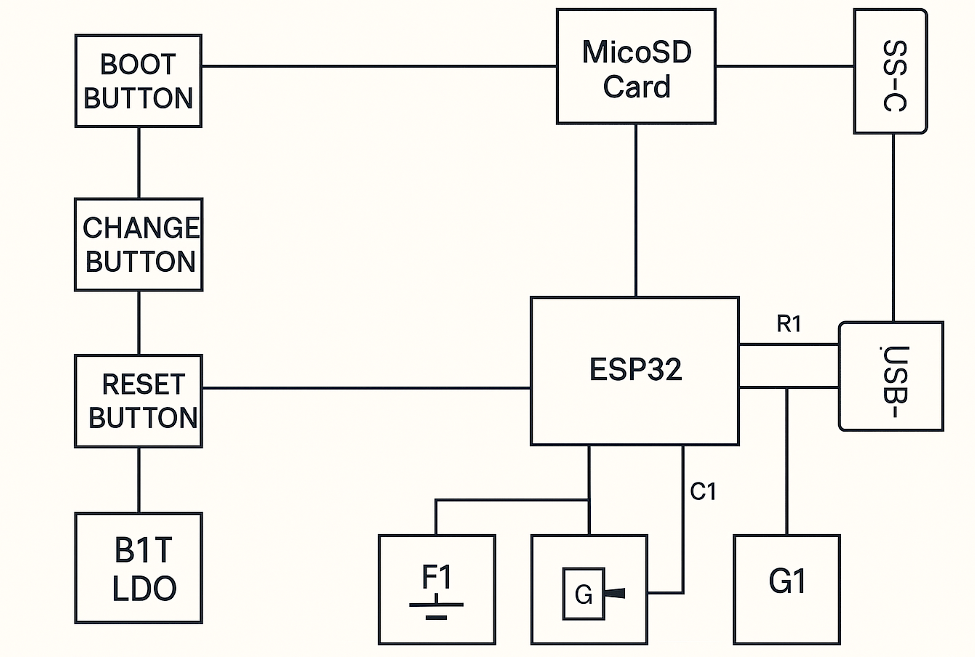

# OpenBook – Open-Source E-Book Reader

OpenBook este un e-book reader open-source, low-cost, dezvoltat în cadrul proiectului TSC.  
Dispozitivul este construit pe baza microcontrolerului **ESP32-C6** și integrează funcționalități avansate de afișare, comunicație și consum redus de energie, fiind pregătit pentru producție în masă.

---

##  Diagrama Bloc

Diagrama bloc care ilustrează conexiunile dintre toate componentele:

---

##  BOM – Bill of Materials

# Bill of Materials (BOM)

| Package | Parts | Datasheet | 
|:--------|:------|:----------|
| ADAFRUIT_CHIP-LED0603 | CHG_LED | [Link](https://www.snapeda.com/parts/KP-1608SURCK/Kingbright/view-part/?ref=search&t=LED%200603) | 
| SJ | SJ1 | [Link](https://grabcad.com/library/solder-jumpers-1) |
| ESP32_WROVER_EAGLE-LTSPICE_R0402 | R1_PWRUSB, R1, R1_PINH1, R2-PINH, R2-PINH1, R5, R6, R7, R8, R9, R10, R_BOOT, R_CL1, R_RESET, R3, R1_PINH, R4, R_CHANGE, R_CAPACITOR, R2, R1_BAT, R2_BAT, R2_USB, R2_USB1 | [Link](https://componentsearchengine.com/part-view/R0402%201%25%20100%20K%20(RC0402FR-07100KL)/YAGEO) | 
| ESP32_WROVER_EAGLE-LTSPICE_C0402 | C1, C2, C4_USB, C6, C8, C9, C10, C_DELAY, EPD_C5, EPD_C1, EPD_C2, EPD_C6, EPD_C7, EPD_C8, EPD_C9, EPD_C10, EPD_C11, EPD_C12, C7, C5, C4, C1_BAT, C1_BAT1, C1_BAT2, C2_BAT, C5_USB | [Link](https://componentsearchengine.com/part-view/CC0402MRX5R5BB106/YAGEO) | 
| RCL_CT3528 | C3 | [Link](https://stud33302.autodesk360.com/g/shares/SH30dd5QT870c25f12fc6065d74bcaa3bf24) |
| 112ATAARR03ATTEND | J4 | [Link](Link) |
| ESP32_WROVER_SPARKFUN-DISCRETESEMI_SOT23-3 | Q1, Q2 | [Link](https://ro.mouser.com/ProductDetail/Microchip-Technology/MCP73831T-5ACI-OT?qs=hH%252BOa0VZEiAcgAcEkuamXg%3D%3D) |
| SOT95P280X125-5N | IC1 | [Link](https://componentsearchengine.com/part-view/BD5229G-TR/ROHM%20Semiconductor) |
| MYBUTTON | BOOT_BUTTON, CHANGE_BUTTON, RESET_BUTTON | [Link](https://industry.panasonic.com/global/en/products/control/switch/light-touch/number/evqpuj02k) |
| CAPCP3225X100N | C10_SUPERCAP | [Link](https://www.snapeda.com/parts/CPH3225A/Seiko+Instruments/view-part/?ref=eda) | 
| SOIC127P1032X265-16N | U3 | [Link](https://www.snapeda.com/parts/DS3231SN%23/Analog+Devices/view-part/?ref=eda) | 
| XCVR_ESP32-C6-WROOM-1-N8 | U2 | [Link](https://www.snapeda.com/parts/ESP32-C6-WROOM-1-N8/Espressif+Systems/view-part/?ref=eda) | 
| ESP32C6_VARISTOR_CT/CN1812 | PFMF.050.1 | [Link](Link) | 
| ESP32_WROVER_AVX---SD0805S020S1R0_AVX_SD0805S020S1R0_0 | D2, D7 | [Link](https://eu.mouser.com/ProductDetail/KYOCERA-AVX/SD0805S020S1R0?qs=jCA%252BPfw4LHbpkAoSnwrdjw%3D%3D) | 
| ESP32_WROVER_BME680_PSON80P300X300X100-8N | SENSOR2 | [Link](https://www.snapeda.com/parts/BME680/Bosch/view-part/?welcome=home) | 
| ESP32_WROVER_SPARKFUN-IC-POWER_SOT23-5 | U0 | [Link](Link) |
| FH34SRJ24S05SH99 | J1 | [Link](Link) | 
| SON50P200X200X80-9N | U4 | [Link](https://www.snapeda.com/parts/MAX17048G+T10/Analog+Devices/view-part/?ref=eda) | 
| SOD3716X135N | D3, D4, D5 | [Link](Lihttps://eu.mouser.com/ProductDetail/KYOCERA-AVX/SD0805S020S1R0?qs=jCA%252BPfw4LHbpkAoSnwrdjw%3D%3Dnk) | 
| DIOC1608X36N | D6, D8, D9, D10, D11, D12 | [Link](https://www.snapeda.com/parts/PGB1010603MR/Littelfuse/view-part/?ref=eda) | 
| JST04_1MM_RA | J3 | [Link](https://componentsearchengine.com/part-view/USB4110-GF-A/GCT%20(GLOBAL%20CONNECTOR%20TECHNOLOGY)) | 
| SAMACSYS_PARTS_USB4110GFA | J2 | [Link](https://componentsearchengine.com/part-view/USB4110-GF-A/GCT%20(GLOBAL%20CONNECTOR%20TECHNOLOGY)) | 
| SOT95P280X145-6N | D1 | [Link](https://www.snapeda.com/parts/USBLC6-2SC6Y/STMicroelectronics/view-part/?ref=eda) | 
| SON127P600X800X80-9N | U1 | [Link](https://www.snapeda.com/parts/W25Q512JVEIQ/Winbond+Electronics/view-part/?ref=eda) | 
| SOT95P280X120-5N | IC4 | [Link](https://www.snapeda.com/parts/W25Q512JVEIQ/Winbond+Electronics/view-part/?ref=eda) |

##  Descriere Hardware

OpenBook folosește următoarele module și componente:

- **ESP32-C6-WROOM-1-N8** – Microcontroller principal cu conectivitate WiFi 6, BLE și Zigbee.
- **W25Q512JVEIQ** – Memorie Flash SPI pentru stocarea datelor.
- **MAX17048** – Fuel Gauge pentru monitorizarea nivelului de încărcare a bateriei.
- **MCP73831** – Circuit de încărcare Li-Ion prin USB Type-C.
- **DS3231** – Ceas de timp real cu acuratețe ridicată.
- **BME680** – Senzor ambiental pentru calitatea aerului, temperatură și umiditate.
- **CPH3225A** – Supercapacitor pentru backup RTC.
- **USB4110-GF-A** – Conector USB Type-C pentru alimentare și comunicație.

**Specificații de comunicație și interfețe:**
- **I2C**: DS3231 (RTC), BME680 (senzor ambiental)
- **SPI**: W25Q512JVEIQ (memorie Flash externă)
- **I2C/SPI**: Ecran E-Paper
- **Fuel Gauge (MAX17048)**: comunicație prin I2C
- **USB**: Alimentare și încărcare prin MCP73831 + conector USB-C

**Calcul de consum de energie:**
- Dispozitivul intră în mod Deep Sleep ESP32 pentru a minimiza consumul (~20 µA).
- Fuel Gauge optimizează încărcarea/descărcarea bateriei pentru o autonomie maximă.

---

##  Pini ESP32-C6 folosiți

| Componentă         | Pini ESP32-C6   | Motivare                                   |
|---------------------|-----------------|--------------------------------------------|
| Ecran E-Paper       | SPI (MOSI, MISO, SCLK, CS, DC, RST, BUSY) | Comunicarea eficientă cu ecranul grafic. |
| W25Q512JVEIQ (Flash)| SPI partajat     | Economie de pini, viteze mari de transfer. |
| DS3231 (RTC)        | I2C SDA, SCL     | Comunicare cu precizie orară.             |
| BME680 (Senzor)     | I2C SDA, SCL     | Comunicare senzor ambiental.              |
| MAX17048 (Fuel Gauge)| I2C SDA, SCL    | Monitorizare nivel baterie.               |
| MCP73831 (Charger)  | GPIO pentru statut încărcare | Monitorizare simplă LED statut încărcare.|
| USB4110-GF-A        | USB D+/D-        | Alimentare și comunicare USB.             |

---

##  Alte informații utile

-  **Design Log**: Documentația completă a deciziilor de design se află în `Documentation/DesignLog.md`.
-  **Randări PCB**: Imagini randate cu placa de circuit imprimat în `Images/PCB_Renders/`.
-  **Carcasă**: Așezarea componentelor în carcasă poate fi vizualizată în `Images/Enclosure/`.

---

